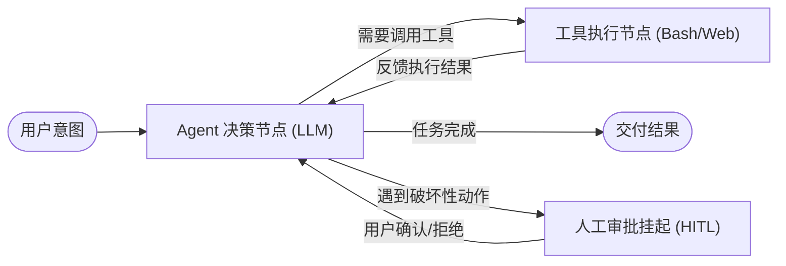

在 LLM 应用开发的早期，大家最熟悉的构建模式是 **Chain（链）**：接收用户 Prompt ➔ 拼装 Context ➔ 调用模型 ➔ 解析输出。

这种单向线性的流水线（Directed Acyclic Graph, DAG）非常适合文档摘要、静态问答等短平快场景。但一旦业务试图构建真正的“自主系统”（如能自主重构代码、多轮调试 Bug、跨系统操作工单的 Agent），线性 Chain 就会彻底失效。

LangChain 团队（特别是 Harrison Chase）在《What is a "cognitive architecture"?》一文中，正式提出了 **Cognitive Architecture（认知架构）** 的概念。这篇文章从该经典理论出发，结合前端状态管理与工程实践，探讨大模型系统究竟该如何“思考”。

---

## 什么是认知架构？

“认知架构”（Cognitive Architecture）最初源自认知心理学与人工智能科学，用于描述人脑如何编排感知、记忆、注意力和决策。

在当今的 AI Agent 系统中，**认知架构特指：代码、提示词、状态与大语言模型调用之间的编排流转机制**。它决定了系统如何接收环境输入、在何处驻留记忆、如何进行条件分支决策，以及如何通过循环（Loops）完成自我修正。

我们可以将 AI 系统的认知复杂度划分为四个演进阶段：

```text
阶段 1: 单次调用 (Router / Single LLM Call)
用户输入 ────> [ Prompt + LLM ] ────> 最终输出

阶段 2: 线性链路 (Linear Chains)
用户输入 ────> [ 检索 RAG ] ────> [ 摘要生成 ] ────> [ 格式化输出 ]

阶段 3: 循环路由器 (Stateful Router & Router Loops)
用户输入 ────> [ 规划决策 ] <────┐
                   │            │ (多次重试/补充检索)
                   ▼            │
             [ 工具执行 ] ───────┘

阶段 4: 有状态图网络 (State Machine / LangGraph)
多节点、共享状态树、带持久化断点、支持人在回路与分支合并的复杂图结构
```

---

## 为什么线性 Chain 无法支撑真正的 Agent？

线性链最大的缺陷是**缺乏自我修正能力（No Reflexion & Loops）**。

在真实工程中，模型调用外部工具的成功率绝不是 100%：

1. SQL 工具可能语法报错；
2. API 查询可能返回空结果；
3. 代码改动可能未通过 TypeScript 编译器。

如果只能一条路走到黑，任何一步的小失误都会直接导致整个任务溃败。真正的智能体必须具备**“执行 ➔ 评估结果 ➔ 发现偏差 ➔ 重新规划 ➔ 再次执行”**的闭环能力。这种循环在图论中对应着**有向有环图（Cyclic Graph）**，这正是线性 DAG 架构无法支持的。

---

## 认知图的核心三要素：State、Nodes 与 Edges

以 LangGraph 为代表的现代认知运行时，把 Agent 的行为抽象为数学上的图状态机：



### 1. 共享状态（State Schema）

状态是贯穿整个图生命周期的核心数据结构（Single Source of Truth）。在前端我们习惯用 Redux 或 Zustand 维护 State，在 Agent 认知架构中同样如此：

```ts
export type AgentGraphState = {
  messages: Array<{ role: "user" | "assistant" | "tool"; content: string }>;
  currentPlan: string[];
  toolOutputs: Record<string, unknown>;
  retryCount: number;
  isCompleted: boolean;
};
```

### 2. 执行节点（Nodes）

节点是纯计算或带副作用的操作单元。一个节点接收当前 `State`，完成某些操作后，返回对 `State` 的**增量补丁（State Update）**。

- `llm_node`：负责理解当前消息并决定是输出文字还是发起 `tool_call`；
- `tool_node`：负责调用真实的浏览器、文件系统或 API 并将结果写回；
- `human_node`：将图执行挂起，等待人工授权。

### 3. 条件边（Conditional Edges）

边决定了状态的流向。特别是条件边，它由 Python/TypeScript 函数动态计算下一步去往哪个节点：

```ts
function shouldContinue(
  state: AgentGraphState
): "tools" | "human_approval" | "end" {
  const lastMessage = state.messages[state.messages.length - 1];

  if (!lastMessage || state.isCompleted) return "end";
  if (lastMessage.content.includes("DROP_TABLE")) return "human_approval";
  if (state.retryCount > 3) return "end";

  return "tools";
}
```

---

## 前端工程师的视角：Agent 认知架构与前端状态机的同构性

当我们把后端的 Agent 认知架构剥去 Python 的外衣，前端工程师会惊讶地发现：**它与前端的经典架构思想高度同构**。

| 概念维度     | 前端现代架构                   | LangGraph / Agent 认知架构             |
| :----------- | :----------------------------- | :------------------------------------- |
| **状态载体** | Redux Store / React Context    | Graph State / Checkpoint Store         |
| **变更驱动** | Action / Event                 | Node Return Delta / State Update       |
| **状态折叠** | Pure Reducer Function          | Reducer Function (如 `add_messages`)   |
| **异步流程** | Redux-Saga / XState Statechart | Cyclic Graph Nodes & Conditional Edges |
| **断点调试** | Redux DevTools Time-travel     | LangGraph Time-travel & Thread History |

这意味着，长期与异步数据流、用户输入冲突、状态机（XState）和乐观更新打交道的前端全栈工程师，实际上在理解 Agent 认知架构方面拥有天然的心智优势。

---

## 结语：从指令调用走向状态编排

大模型本身并不具备持续的执行力，它只是一个强大的单步推理器。

让它产生类似人类工程师般严密、可靠、能自我纠错的智能表现的，正是包裹在它外层的**认知架构**。从简单的线性 Chain 迈向有状态的循环图，是构建真正生产级 AI 系统的关键分水岭。
