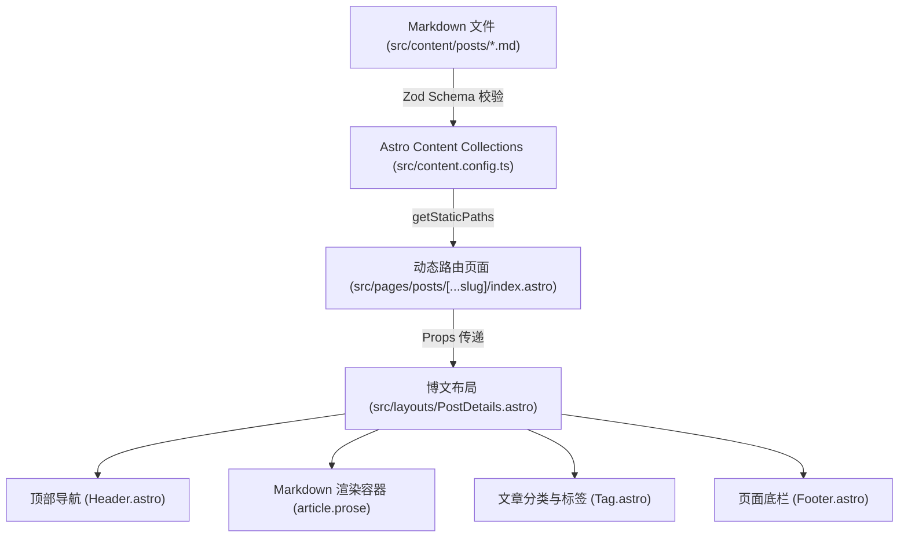

接手一个动辄几十万行、经历过数次人员更迭的前端项目，是几乎每位工程师都会经历的“阵痛期”。

如果你直接把整个项目抛给 AI 并输入：“请帮我解释一下这个项目是做什么的”，你大概率只会得到一段泛泛而谈的废话：“这是一个使用现代前端技术构建的 Web 应用，具有良好的用户体验……”。

让 Claude Code 真正帮上忙的关键，是**把发散式提问转化为带约束条件的“四阶渐进式勘测法”**，要求每一处结论都必须附带具体的文件路径和代码行号。

---

## 四阶渐进式勘测框架

在阅读陌生项目时，优秀的工程师从来不会从头到尾按字母顺序看代码，而是遵循由外及内、由静态到动态的排查路径：

```text
┌────────────────────────────────────────────────────────┐
│               前端项目四阶渐进式勘测模型                │
└────────────────────────────────────────────────────────┘
                          │
         Phase 1: 骨架与配置层 (Build & Manifest)
         - 锁定包管理器、构建工具、环境变量与 TypeScript 别名
                          │
         Phase 2: 路由与页面拓扑 (Routing & Layouts)
         - 梳理静态/动态路由、嵌套布局层级与路由守卫
                          │
         Phase 3: 数据流与契约层 (Data Flow & Contracts)
         - 追踪服务端数据获取、Content Schema、客户端缓存与 API 边界
                          │
         Phase 4: 客户端孤岛与副作用 (Islands & Side Effects)
         - 识别客户端状态同步、浏览器事件监听与异步副作用
```

---

## 第一阶：骨架与基础设施定位

首先搞清楚项目的运行环境与技术边界。向 Claude Code 发送以下 Prompt：

```text
你现在是一名资深架构师，请只读分析当前项目的基础设施，不要修改任何文件：
1. 识别包管理器（pnpm/npm/yarn）以及核心框架版本。
2. 提取 tsconfig.json 中的路径别名（paths mapping）。
3. 梳理核心 scripts 命令：开发（dev）、类型检查（typecheck）、构建（build）和测试（test）。
4. 找出项目最重要的全局环境变量及其作用。
请以 Markdown 表格输出，每条结论附带来源配置文件。
```

在几秒内，Claude Code 会定位到 `package.json`、`tsconfig.json` 和 `astro.config.ts`，给出清晰的技术底座清单。你立刻就能明确：这是 `pnpm` 驱动的 Astro 5 项目，配置了 `@/*` 别名，且严格禁止直接使用全局 `Buffer`。

---

## 第二阶：路由与页面渲染链条映射

前端的核心脉络在于“URL 是如何映射为 DOM 树的”。以博客项目的动态博文路由为例，我们引导它追踪端到端链路：

```text
请分析 src/pages/posts/[...slug]/ 路由的完整渲染链路：
1. getStaticPaths 如何从数据源拉取并生成所有的 slug 参数？
2. 页面使用了哪个主布局组件（Layout）？该布局包含了哪些通用组件（如 Header, Footer, SEO）？
3. 博文正文（Markdown/MDX）是在哪一步被转换为 HTML 的？
4. 请用 Mermaid 流程图绘制出从“数据源”到“最终 HTML 页面”的流转过程。
必须附带具体的文件相对路径。
```

Claude Code 将会通过符号检索定位到 `src/content.config.ts`、`src/pages/posts/[...slug]/index.astro` 和 `src/layouts/PostDetails.astro`，并生成如下的高清拓扑图：



有了这张带真实路径的结构图，你无论是要修改 SEO 标签还是排查正文排版，都能瞬间找对入口。

---

## 第三阶：数据获取与缓存模式审计

很多老前端项目的暗坑往往藏在“数据到底从哪来”：是服务端直出（SSR）、静态预构建（SSG）、还是客户端 `useEffect` 异步拉取？

让 Claude Code 进行专项数据审计：

```text
只读分析当前项目中所有数据拉取（Data Fetching）机制：
1. 找出所有 fetch、axios 或 API Client 调用，区分服务端请求与客户端请求。
2. 检查数据缓存策略（是无缓存、Cache-Control 还是客户端 SWR/React Query 缓存？）。
3. 检查是否存在重复的请求竞态或未捕获的错误分支。
```

如果代码中存在诸如在客户端轮询、或者在 SSR 阶段串行调用 5 个微服务接口的操作，Agent 都能通过 AST 和正则检索精准定位到代码行，成为性能重构的第一手依据。

---

## 超大型仓库与 Monorepo 的防爆策略

在代码量超过百万行的 Monorepo 中，全量上下文加载不仅会导致 Token 费用暴增，还会大幅拖慢 Agent 的推理速度。

采取以下工程手段控制上下文：

1. **配置 `.claudeignore`**：
   在工程根目录创建 `.claudeignore`，把无关构建产物和本地缓存全部排除：
   ```text
   dist/
   .astro/
   public/pagefind/
   node_modules/
   coverage/
   *.log
   ```
2. **目录限定（Scoped Session）**：
   若只需要分析移动端前台，先 `cd apps/mobile-web`，再执行 `claude`。让 Agent 默认的根工作区锁定在子模块内。
3. **强制按需抓取**：
   在提示词中明确加注：“禁止全量遍历目录，先通过文件索引或 `grep` 定位关键符号，确认后再阅读具体实现”。

---

## 结语

接手陌生前端项目，最怕盲人摸象。通过“基础设施 ➔ 路由拓扑 ➔ 数据流动 ➔ 状态副作用”的四阶递进提问法，Claude Code 可以在 15 分钟内为你拼装出一张高清、可核验的代码地图。

你不再是被动翻找代码的“人肉检索器”，而是手握全局地图的“指挥官”，能从第一天起就胸有成竹地推进业务开发。
