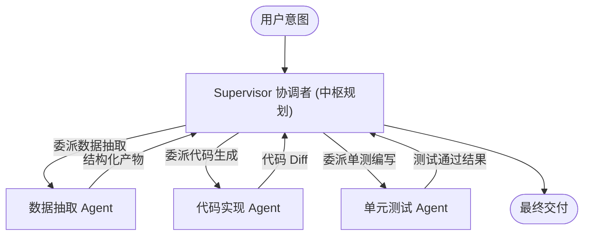

在 AI 领域，“多智能体（Multi-Agent）”是最近讨论最热烈的概念之一。不少团队在演示中一口气创建了十几个 Agent：“产品经理 Agent”、“架构师 Agent”、“前端 Agent”、“测试 Agent”、“安全审查 Agent”，让它们在界面上煞有介事地互相打字聊天。

然而，一旦进入真实生产交付，很多团队立刻会被打回原形：

- 系统响应奇慢无比，Token 账单成倍暴涨；
- 两个 Agent 在同一个需求定义上打转，发生逻辑死锁；
- 输出结果比单个大模型完成的质量还要低。

LangChain CEO Harrison Chase 在《How and when to build multi-agent systems》一文中，一针见血地指出了问题的本质：**多 Agent 架构的本质是上下文工程（Context Engineering）**。

如果你不知道为什么要切分上下文，盲目增加 Agent 数量只会制造灾难。

---

## 为什么要多 Agent？本质是注意力与上下文隔离

为什么不把所有的工具、文档和职责都塞给一个拥有 200 万 Token 窗口的大模型？

因为大模型的**注意力机制是有限资源**。当单个上下文窗口塞入了 50 个工具定义、3000 行项目代码和复杂的跨领域业务规范时，模型会出现明显的**“注意力稀释（Context Pollution）”**：

1. **工具误选率激增**：在 50 个工具中选错参数或调用错误的概率远高于在 5 个工具中做选择；
2. **长尾记忆衰减**：在长文本推理中，模型容易忽略早期的核心边界约束；
3. **职责泛化平庸**：一个试图同时扮演产品、编码和测试的模型，在每一步的专业度上都会打折扣。

**切分出多个 Agent 的唯一正当理由，是为了给每个子任务提供一个干净、高度聚焦的专属上下文窗口。**

```text
┌────────────────────────────────────────────────────────┐
│               多 Agent 架构的本质：上下文隔离           │
└────────────────────────────────────────────────────────┘
          ┌─────────────────┐
          │  用户大型复杂需求 │
          └────────┬────────┘
                   │
         ┌─────────┴─────────┐
         ▼ 粗粒度上下文       ▼ 粗粒度上下文
   ┌───────────┐       ┌───────────┐
   │ Agent A   │       │ Agent B   │
   │ 专属上下文 │       │ 专属上下文 │
   │ (仅 3工具) │       │ (仅 4工具) │
   └───────────┘       └───────────┘
```

---

## 三种主流多 Agent 协作拓扑对比

在系统设计时，千万不要随便让所有 Agent 自由乱聊。业界验证成熟的组织拓扑主要有以下三种：

### 1. 主从监督模式（Supervisor Architecture，最推荐）

由一个中枢协调者（Supervisor）统领全局，按需将任务委派给具备专业技能的 Worker Agent，Worker 执行完毕后向 Supervisor 汇总成果。



- **优点**：执行流确定，状态集中可控，绝不会发生两个 Worker 互相死锁的问题；
- **适用场景**：绝大多数企业级软件开发、复杂数据分析与跨系统审批。

### 2. 网状通信模式（Network / Peer-to-Peer）

每个 Agent 都可以直接向其他 Agent 发起通信和移交控制权（Hand-off）。

- **缺点**：难以调试，容易陷入 A 问 B、B 问 C、C 又问 A 的无限循环，必须设定严格的单次跳数（Max Hops）安全阈值；
- **适用场景**：头脑风暴、角色扮演辩论或开放式探索任务。

### 3. 分层分形模式（Hierarchical Tree）

Supervisor 下面管着 Sub-supervisors，层层拆解。适合数十万行的大型代码仓库全局迁移。

---

## 黄金法则：读写分离（Read vs. Write Agents）

Harrison Chase 在长文中提出了一个极其关键的工程洞见：**只读多 Agent 系统极其容易做，写入多 Agent 系统极其危险。**

- **并行读（Read Parallelism）**：
  例如让 Agent 1 负责爬取竞品官网，Agent 2 负责检索内网飞书文档，Agent 3 负责查询 GitHub 历史提交。它们各自读取互不影响，最后汇总成一份调研报表。这种多 Agent 并行几乎没有任何工程风险，ROI 极高。
- **并发写（Write Concurrency）**：
  如果 Agent A 在修改用户注册模块的路由，Agent B 同时也在修改路由重定向逻辑，两个 Agent 的补丁立刻会产生不可调和的冲突，甚至覆盖彼此的代码。

**工程准则**：

> 尽量让多 Agent 在“读取、分析、建议”阶段并行；在“落地修改、写入数据库、Git 提交”阶段，必须收束为单点串行执行，或基于物理工作区（如 Git Worktree）进行文件级彻底隔离。

---

## 决策检查清单：你的业务真的需要多 Agent 吗？

在决定重构为多 Agent 前，先问自己这四个问题：

1. **工具数量是否已严重超标（> 20 个）？**
   - 否 ➔ 单 Agent + System Prompt 针对性微调足够，不要加剧复杂度。
2. **任务是否需要不同大模型混合编排？**
   - 例如规划使用 Claude 3.5 Sonnet，海量文档初步筛选使用快速廉价的 Flash 级别模型 ➔ 适合拆分。
3. **子任务之间的上下文是否高度独立？**
   - 如果子任务 B 极度依赖子任务 A 的微观细节，拆分 Agent 会导致频繁的上下文序列化反序列化，得不偿失。
4. **团队是否有完善的可观测性基础设施（如 LangSmith）？**
   - 没有追踪工具前搞多 Agent，排查 Bug 时如同在深海捞针。

---

## 结语

多 Agent 不是为了在 PPT 里画出复杂的连线图，而是为了**在有限的注意力预算内，给模型创造最优的思考环境**。

克制使用、严控写权限、拥抱主从拓扑——在工程实践中，往往架构越简练、边界越克制的多 Agent 系统，才能走得越稳、越长久。
